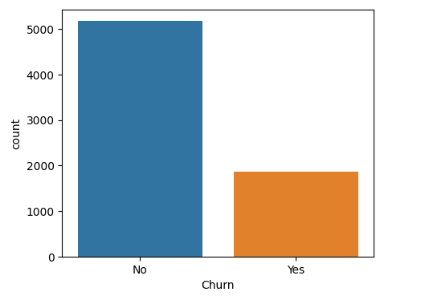

# 📉 Telco Customer Churn Prediction


## 📌 Visão Geral

Este projeto tem como objetivo desenvolver um modelo de Machine Learning capaz de prever o **Churn (cancelamento)** de clientes de uma empresa de telecomunicações.

Identificar clientes com alta probabilidade de cancelamento permite que a empresa adote ações preventivas de retenção, reduzindo perdas financeiras e aumentando a satisfação do cliente.

---

## 🗂️ O Dataset

Foi utilizado o conjunto de dados **Telco Customer Churn**, contendo informações sobre:
* **Demografia:** Gênero, Idosos, Parceiros, Dependentes.
* **Serviços:** Telefone, Internet (DSL/Fibra), Segurança Online, Backup, Streaming, etc.
* **Conta:** Tipo de contrato, Método de pagamento, Faturamento digital.
* **Métricas:** `Tenure` (tempo de permanência), `MonthlyCharges` (cobrança mensal), `TotalCharges`.
* **Target:** `Churn` (Yes/No).

---

## 📊 Análise Exploratória (EDA)

A análise inicial revelou padrões importantes no comportamento dos clientes.

### 1. Desbalanceamento de Classes
O dataset apresenta um desbalanceamento natural, com mais clientes retidos ("No") do que cancelados ("Yes").



### 2. Correlação de Variáveis
Investigou-se como variáveis numéricas (como cobrança mensal e tempo de contrato) se relacionam com o cancelamento.


**Principais Insights:**
* Clientes com **contratos mensais** têm maior taxa de cancelamento.
* Clientes novos (baixo `tenure`) são mais propensos ao churn.
* Usuários de **Fibra Óptica** apresentam taxas de churn mais elevadas que usuários de DSL.

---

## ⚙️ Pipeline de Machine Learning

O projeto seguiu um fluxo rigoroso de processamento de dados:

1.  **Pré-processamento:**
    * Tratamento de valores vazios em `TotalCharges`.
    * Conversão da variável alvo (`Churn`) para binário (0/1).
    * **Encoding:** Utilização de `Get Dummies` para variáveis categóricas.
    * **Scaling:** Normalização de dados numéricos com `MinMaxScaler`.
2.  **Modelagem:**
    Foram testados diversos algoritmos, incluindo:
    * Logistic Regression
    * Decision Tree
    * Random Forest
    * **Gradient Boosting (Modelo Escolhido)**
    * XGBoost / LGBM

---

## 🏆 Resultados

O modelo de **Gradient Boosting** apresentou a melhor performance geral, equilibrando a capacidade de generalização e a precisão na detecção dos cancelamentos.

### Matriz de Confusão
Abaixo, a performance do modelo nos dados de teste:


| Métrica | Performance |
| :--- | :---: |
| **Acurácia** | **~80%** |
| **Precision** | **Alta** |
| **Recall** | **Balanceado** |

*O modelo demonstrou ser eficaz para segmentar a base de clientes e priorizar ações de marketing.*

---

## 🚀 Como Executar

1.  **Clone o repositório:**
    ```bash
    git clone [https://github.com/seu-usuario/telco-churn-analysis.git](https://github.com/seu-usuario/telco-churn-analysis.git)
    ```
2.  **Instale as dependências:**
    ```bash
    pip install pandas numpy scikit-learn seaborn matplotlib plotly xgboost lightgbm
    ```
3.  **Execute o Notebook:**
    Abra o arquivo `Churn_Analysis_Telco.ipynb` no Jupyter ou Google Colab.

---

## 👨‍💻 Autor

**Alexander Lira**
*Data Scientist | Machine Learning*

[](SEU_LINK_DO_LINKEDIN)
